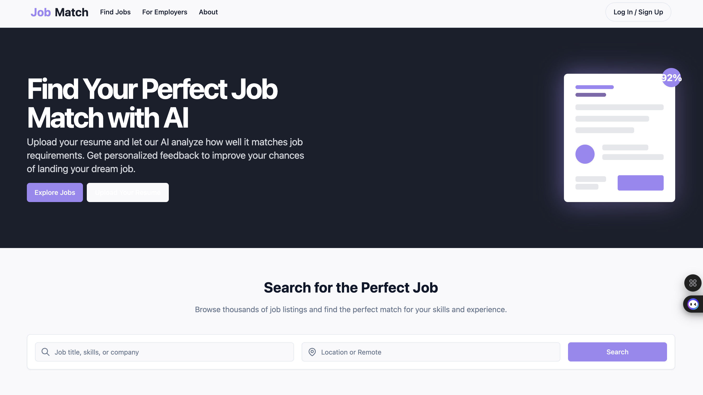

# 🚀 AI-Powered Career Path

[](https://job-match-jade.vercel.app/) 
[](LICENSE)

> *Unlock your dream job, powered by AI. Where talent meets opportunity, instantly.*

---

## 🌐 Live Demo

▶️ **Check out the deployed app:** [job-match-jade.vercel.app](https://job-match-jade.vercel.app/)

---

## 🌟 What is This?

**AI-Powered Career Path** is a next-gen platform that connects job seekers with employers using the magic of Artificial Intelligence. Whether you’re searching for your next adventure or hunting for the perfect hire, our smart algorithms make the match effortless, efficient, and fun!

---

## ✨ Features

- 🤖 **AI-Driven Job Matching**: Find jobs tailored to your unique skills, interests, and goals.
- 🏢 **Employer Dashboard**: Post jobs, discover candidates, and manage applications with ease.
- 🧑‍💼 **Personalized Career Roadmaps**: Get actionable insights and growth suggestions.
- 🔍 **Advanced Search & Filters**: Zero in on the perfect opportunity or candidate.
- 📱 **Modern, Responsive UI**: Works beautifully on any device.

---

## 🖼️ App Screenshot



<sub>_(Don’t see an image? Add your screenshot as `screenshot.png` in the repo root!)_</sub>

---

## 🚦 Quickstart

1. **Clone the repo:**
   ```bash
   git clone https://github.com/yugallohani/JobMatch.git
   cd JobMatch
   ```
2. **Install dependencies:**
   ```bash
   npm install
   # or
   yarn install
   ```
3. **Run locally:**
   ```bash
   npm run dev
   # or
   yarn dev
   ```
4. Open [http://localhost:5173](http://localhost:5173) in your browser and start exploring!

---

## 🛠️ Built With

- **React + TypeScript**
- **Vite**
- **Tailwind CSS**
- **Supabase** (for auth & data)
- **Radix UI**

---

## 🤝 Contributing

We welcome PRs, feature ideas, and bug reports! Please:
- Fork the repo
- Create a new branch (`feat/your-feature`)
- Submit a pull request

Let’s build the future of work—together!

---

## 📬 Contact & Community

- Issues? Suggestions? [Open an Issue](https://github.com/yugallohani/JobMatch/issues)
- Want to chat? [Join our Discord](#) *(coming soon!)*

---

## 🎉 License

MIT — free for personal and commercial use.

---

> **Made with ❤️ by passionate devs & dreamers. Your next opportunity starts here!**